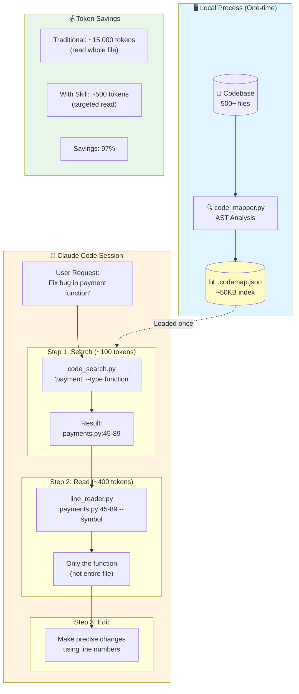

<p align="center">
  
  
  
  
</p>

<h1 align="center">🧭 Claude Code Navigator</h1>

<p align="center">
  <strong>Reduce token usage by 97% when working with large codebases in Claude Code</strong>
</p>

<p align="center">
  <em>Pre-index your codebase locally. Search symbols instantly. Read only what you need.</em>
</p>

---

## 🎯 The Problem

When using AI coding assistants with large codebases, **reading entire files burns through tokens fast**:

| Codebase Size | Traditional Approach | Token Cost |
|--------------|---------------------|------------|
| 100 files | Read relevant files | ~150,000 tokens |
| 500 files | Read relevant files | ~750,000 tokens |
| 1000+ files | Read relevant files | 2,000,000+ tokens |

**One bug fix shouldn't cost you thousands of tokens just to find the right function.**

## 💡 The Solution

Claude Code Navigator creates a lightweight index of your codebase **locally**, enabling:

- **Instant symbol search** - Find functions, classes, methods by name
- **Surgical reads** - Load only the exact lines you need (not entire files)
- **Dependency awareness** - See what calls what without reading everything

```
┌─────────────────────────────────────────────────────────────┐
│                    WITHOUT THIS TOOL                        │
├─────────────────────────────────────────────────────────────┤
│  User: "Fix the payment bug"                                │
│                                                             │
│  Claude reads:                                              │
│  • payments.py      (500 lines)  → 7,500 tokens            │
│  • billing.py       (300 lines)  → 4,500 tokens            │
│  • models/order.py  (200 lines)  → 3,000 tokens            │
│  ─────────────────────────────────────────────             │
│  Total:                            15,000 tokens            │
└─────────────────────────────────────────────────────────────┘

┌─────────────────────────────────────────────────────────────┐
│                     WITH THIS TOOL                          │
├─────────────────────────────────────────────────────────────┤
│  User: "Fix the payment bug"                                │
│                                                             │
│  1. Search: "payment" → payments.py:45-89                   │
│     Cost: ~100 tokens                                       │
│                                                             │
│  2. Read: lines 45-89 only                                  │
│     Cost: ~400 tokens                                       │
│  ─────────────────────────────────────────────             │
│  Total:                               500 tokens            │
│                                                             │
│  SAVINGS: 97% fewer tokens!                                 │
└─────────────────────────────────────────────────────────────┘
```

## 🚀 Quick Start (< 2 minutes)

### Installation

```bash
# Install via pip
pip install claude-code-navigator

# Or clone and install locally
git clone https://github.com/efrenbl/claude-code-navigator.git
cd claude-code-navigator
pip install -e .
```

### Generate Your Code Map

```bash
# Navigate to your project
cd /path/to/your/project

# Generate the index (one-time, ~10 seconds for most projects)
code-map /path/to/your/project
```

This creates a `.codemap.json` file (~1-5% of your codebase size).

### Search and Read

```bash
# Find a function
code-search "process_payment"

# Read only the lines you need
code-read src/payments.py 45-89
```

**That's it!** You're now saving 90%+ tokens on every code exploration.

---

## 🤖 Using with Claude Code (CLI)

This tool integrates seamlessly with Claude Code. Install the skill and let Claude handle everything automatically.

### Installation as Claude Code Skill

```bash
# For a specific project
mkdir -p .claude/skills
unzip code-map-navigator.skill -d .claude/skills/

# For all your projects (personal)
mkdir -p ~/.claude/skills
unzip code-map-navigator.skill -d ~/.claude/skills/
```

### Automatic Activation

Once installed, Claude Code activates the skill automatically when you mention:
- "map the code" / "generate codemap"
- "optimize tokens"
- "find the function X"
- "search for class Y"

### Example Session

```bash
cd /your/project
claude

# Inside Claude Code:
> Map this project to optimize tokens

Claude: [Runs code_mapper.py -> creates .codemap.json]
        Map generated: 45 files, 303 symbols

> Find the function that handles payments

Claude: [Runs code_search.py "payment"]
        Found: process_payment in src/billing.py:45-89

> Show me that function

Claude: [Runs line_reader.py src/billing.py 45-89]
        [Shows only lines 45-89, not the entire file]
```

### Direct Invocation

```bash
# From terminal
claude "/code-map-navigator"

# Or inside a Claude Code session
/code-map-navigator
```

---

## 📖 Detailed Usage

### 1. Generating the Code Map

```bash
# Basic usage
code-map /your/project

# With custom output location
code-map /your/project -o custom-map.json

# Exclude patterns
code-map /your/project -i "test_*.py" "migrations/"

# Pretty-print JSON (for debugging)
code-map /your/project --pretty
```

**Output:** A `.codemap.json` containing:
- All functions, classes, methods with exact line numbers
- Signatures and truncated docstrings
- Dependency graph (what calls what)
- File hashes for change detection

### 2. Searching for Code

```bash
# Search by symbol name (fuzzy matching enabled)
code-search "UserService"

# Filter by type
code-search "User" --type class
code-search "validate" --type function

# Search within specific files
code-search "handler" --file "api/"

# Show file structure (all symbols in a file)
code-search --structure src/models/user.py

# Find dependencies
code-search --deps "calculate_total"

# Codebase statistics
code-search --stats
```

**Example output:**
```json
[{
  "name": "process_payment",
  "type": "function",
  "file": "src/billing/payments.py",
  "lines": [45, 89],
  "signature": "def process_payment(user_id: int, amount: Decimal) -> PaymentResult",
  "docstring": "Process a payment for the given user...",
  "score": 1.0
}]
```

### 3. Reading Specific Lines

```bash
# Read a single range
code-read src/api.py 45-60

# Read multiple ranges (intelligently merged)
code-read src/api.py "10-20,45-60,100-110"

# Add context lines before/after
code-read src/api.py 45-60 -c 3

# Smart symbol reading (auto-truncates large functions)
code-read src/api.py 45-150 --symbol --max-lines 50

# Search for pattern in file
code-read src/api.py --search "def process"

# Human-readable output
code-read src/api.py 45-60 -o code
```

**Example output (JSON):**
```json
{
  "file": "src/billing/payments.py",
  "range": [45, 89],
  "truncated": false,
  "lines": [
    {"num": 45, "content": "def process_payment(user_id, amount):", "in_range": true},
    {"num": 46, "content": "    \"\"\"Process a payment.\"\"\"", "in_range": true}
  ]
}
```

**Example output (code format):**
```
# src/billing/payments.py
> 45 | def process_payment(user_id, amount):
> 46 |     """Process a payment."""
> 47 |     validate_amount(amount)
```

---

## 🔄 Typical Workflow

**User:** "Fix the bug in the payment processing function"

```bash
# Step 1: Search for the function
$ code-search "payment" --type function

[{"name": "process_payment", "file": "src/billing/payments.py", "lines": [45, 89]}]

# Step 2: Read only that function
$ code-read src/billing/payments.py 45-89 --symbol -o code

# src/billing/payments.py
> 45 | def process_payment(user_id: int, amount: Decimal) -> PaymentResult:
> 46 |     """Process a payment for the given user."""
> 47 |     if amount <= 0:
> 48 |         raise ValueError("Amount must be positive")
...

# Step 3: Make your fix using exact line numbers
# Edit line 47-48 to fix the validation logic
```

**Result:** Fixed the bug while reading only 45 lines instead of 500+ lines across multiple files.

---

## 📊 Performance Benchmarks

Tested on real-world open source projects:

| Project | Files | Symbols | Map Size | Map Time | Search Time |
|---------|-------|---------|----------|----------|-------------|
| Flask | 142 | 1,847 | 89 KB | 0.8s | <10ms |
| Django | 2,156 | 28,493 | 1.2 MB | 8.2s | <15ms |
| requests | 47 | 412 | 23 KB | 0.3s | <5ms |
| numpy | 1,893 | 19,284 | 980 KB | 6.1s | <12ms |

**Token savings in practice:**
- Small projects (50-100 files): 85-90% reduction
- Medium projects (100-500 files): 92-96% reduction
- Large projects (500+ files): 97-99% reduction

---

## 🗺️ Architecture



### Components

| Component | Purpose | Input | Output |
|-----------|---------|-------|--------|
| `code_mapper.py` | Index codebase | Directory path | `.codemap.json` |
| `code_search.py` | Find symbols | Query + filters | JSON results with locations |
| `line_reader.py` | Read specific lines | File + line range | Code content |

---

## 🌐 Supported Languages

| Language | Analysis Type | Quality |
|----------|---------------|---------|
| Python | Full AST | ⭐⭐⭐⭐⭐ |
| JavaScript | Regex-based | ⭐⭐⭐⭐ |
| TypeScript | Regex-based | ⭐⭐⭐⭐ |
| Java | Regex-based | ⭐⭐⭐ |
| Go | Regex-based | ⭐⭐⭐ |
| Rust | Regex-based | ⭐⭐⭐ |
| C/C++ | Regex-based | ⭐⭐⭐ |
| Ruby | Regex-based | ⭐⭐⭐ |
| PHP | Regex-based | ⭐⭐⭐ |

Python receives full AST analysis with accurate line ranges. Other languages use regex patterns that work well for most codebases.

---

## 🔧 Installation Options

### Option 1: pip (Recommended)

```bash
pip install claude-code-navigator
```

### Option 2: pipx (Isolated environment)

```bash
pipx install claude-code-navigator
```

### Option 3: From source

```bash
git clone https://github.com/efrenbl/claude-code-navigator.git
cd claude-code-navigator
pip install -e .
```

### Option 4: As Claude Code Skill

Copy the `code-map-navigator.skill` file to your Claude Code skills directory.

### Requirements

- Python 3.8+
- No external dependencies (uses only standard library)

---

## ❓ FAQ

<details>
<summary><strong>When should I regenerate the code map?</strong></summary>

Regenerate when:
- Adding new files to the project
- After major refactoring
- When search results seem stale

The map is fast to regenerate (usually under 10 seconds).
</details>

<details>
<summary><strong>Does this work with all programming languages?</strong></summary>

Python gets full AST analysis. JavaScript, TypeScript, Java, Go, Rust, C/C++, Ruby, and PHP use regex-based analysis that works well for most code patterns.
</details>

<details>
<summary><strong>How large is the .codemap.json file?</strong></summary>

Typically 1-5% of your source code size. A 10 MB codebase produces roughly a 100-500 KB map.
</details>

<details>
<summary><strong>Can I use this outside of Claude Code?</strong></summary>

Yes! The tools are standalone Python scripts that work in any terminal. They're useful for any situation where you need to quickly locate and read specific code.
</details>

<details>
<summary><strong>What about binary files and generated code?</strong></summary>

The mapper automatically ignores common patterns like `node_modules`, `__pycache__`, `dist`, `build`, etc. Use `-i` to add custom ignore patterns.
</details>

---

## 🤝 Contributing

We welcome contributions! See [CONTRIBUTING.md](CONTRIBUTING.md) for guidelines.

### Quick contribution ideas:
- Add support for more languages (Ruby, PHP, Kotlin)
- Improve regex patterns for existing languages
- Add incremental map updates
- Create IDE integrations

---

## 📄 License

MIT License - see [LICENSE](LICENSE) for details.

---

## 🙏 Acknowledgments

Built for the Claude Code community to make AI-assisted coding more efficient and cost-effective.

---

<p align="center">
  <strong>Stop burning tokens reading entire files.</strong><br>
  <em>Map once, search instantly, read surgically.</em>
</p>
