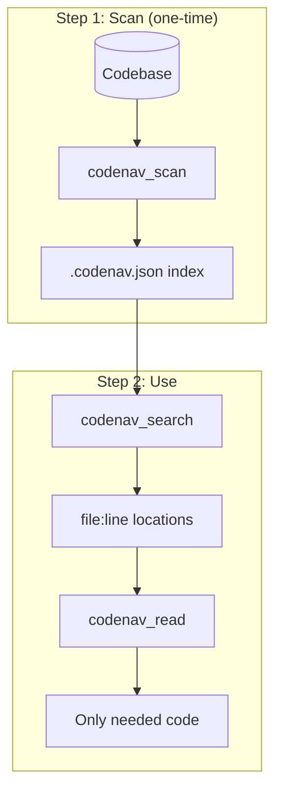

<p align="center">
  
  
  
  
</p>

<h1 align="center">🧭 Code Navigator</h1>

<p align="center">
  <strong>An MCP server for token-efficient code navigation</strong>
</p>

<p align="center">
  <em>Reduce token usage by 97% when exploring large codebases with Claude</em>
</p>

---

## What is Code Navigator?

Code Navigator is a **Model Context Protocol (MCP) server** that helps AI assistants like Claude explore codebases efficiently. Instead of reading entire files, it provides:

- **Instant symbol search** - Find functions, classes, methods by name
- **Surgical reads** - Load only the exact lines you need
- **Dependency awareness** - See what calls what without reading everything

```
┌─────────────────────────────────────────────────────────────┐
│                    WITHOUT CODE NAVIGATOR                   │
├─────────────────────────────────────────────────────────────┤
│  User: "Fix the payment bug"                                │
│                                                             │
│  Claude reads:                                              │
│  • payments.py      (500 lines)  → 7,500 tokens             │
│  • billing.py       (300 lines)  → 4,500 tokens             │
│  • models/order.py  (200 lines)  → 3,000 tokens             │
│  ─────────────────────────────────────────────              │
│  Total:                            15,000 tokens            │
└─────────────────────────────────────────────────────────────┘

┌─────────────────────────────────────────────────────────────┐
│                     WITH CODE NAVIGATOR                     │
├─────────────────────────────────────────────────────────────┤
│  User: "Fix the payment bug"                                │
│                                                             │
│  1. codenav_search("payment") → payments.py:45-89           │
│     Cost: ~100 tokens                                       │
│                                                             │
│  2. codenav_read(payments.py, 45, 89)                       │
│     Cost: ~400 tokens                                       │
│  ─────────────────────────────────────────────              │
│  Total:                               500 tokens            │
│                                                             │
│  SAVINGS: 97% fewer tokens!                                 │
└─────────────────────────────────────────────────────────────┘
```

---

## Quick Start

### 1. Install

```bash
pip install codenav
```

### 2. Configure Claude Desktop

Add to `~/Library/Application Support/Claude/claude_desktop_config.json` (macOS) or `%APPDATA%\Claude\claude_desktop_config.json` (Windows):

```json
{
  "mcpServers": {
    "codenav": {
      "command": "codenav-mcp"
    }
  }
}
```

### 3. Configure Claude Code (CLI)

Add to `~/.claude/mcp.json`:

```json
{
  "mcpServers": {
    "codenav": {
      "command": "codenav-mcp"
    }
  }
}
```

### 4. Configure Claude Code (VS Code)

Add to your VS Code `settings.json`:

```json
{
  "claude.mcpServers": {
    "codenav": {
      "command": "codenav-mcp"
    }
  }
}
```

### 5. Verify Installation

```bash
# Check the entry point is available
codenav-mcp --help

# Test with MCP Inspector (optional)
npx @anthropic/mcp-inspector codenav-mcp
```

### 6. Use It

In Claude, just ask to explore your codebase:

```
"Scan this project and find the payment function"
"Show me the architecture of this codebase"
"What files import the UserService class?"
```

Claude will automatically use the Code Navigator tools to explore efficiently.

---

## Available Tools

| Tool | Purpose | When to Use |
|------|---------|-------------|
| `codenav_scan` | Index codebase | First step for any new project |
| `codenav_search` | Find symbols | Looking for specific function/class |
| `codenav_read` | Read lines | After finding symbol location |
| `codenav_stats` | Codebase overview | Understanding project size |
| `codenav_get_hubs` | Find central files | Architecture analysis |
| `codenav_get_structure` | File outline | Before reading a file |
| `codenav_get_dependencies` | Import graph | Understanding coupling |

---

## How It Works



1. **Scan once** - Creates `.codenav.json` with all symbols indexed
2. **Search by name** - Find functions/classes/methods instantly
3. **Read surgically** - Load only the lines you need

---

## CLI Usage (Secondary)

While the primary use case is via MCP, you can also use the CLI directly:

```bash
# Generate code map
codenav map .

# Search for symbols
codenav search "process_payment"

# Read specific lines
codenav read src/payments.py 45-89

# Get codebase stats
codenav stats
```

---

## Configuration

### Alternative: Using uv or pipx

```bash
# Using uv
uv pip install codenav

# Using pipx (isolated environment)
pipx install codenav
```

### Claude Desktop with explicit Python path

If you have multiple Python installations:

```json
{
  "mcpServers": {
    "codenav": {
      "command": "python",
      "args": ["-m", "codenav.mcp"]
    }
  }
}
```

### With workspace directory

```json
{
  "mcpServers": {
    "codenav": {
      "command": "codenav-mcp",
      "args": ["--workspace", "/path/to/your/project"]
    }
  }
}
```

---

## Supported Languages

| Language | Analysis Type | Quality |
|----------|---------------|---------|
| Python | Full AST | ⭐⭐⭐⭐⭐ |
| JavaScript | AST (tree-sitter)* | ⭐⭐⭐⭐⭐ |
| TypeScript | AST (tree-sitter)* | ⭐⭐⭐⭐⭐ |
| Java | Regex-based | ⭐⭐⭐ |
| Go | Regex-based | ⭐⭐⭐ |
| Rust | Regex-based | ⭐⭐⭐ |
| C/C++ | Regex-based | ⭐⭐⭐ |
| Ruby | Regex-based | ⭐⭐⭐ |
| PHP | Regex-based | ⭐⭐⭐ |

*Install tree-sitter support: `pip install codenav[ast]`

---

## Performance

Tested on real-world open source projects:

| Project | Files | Symbols | Map Size | Map Time |
|---------|-------|---------|----------|----------|
| Flask | 142 | 1,847 | 89 KB | 0.8s |
| Django | 2,156 | 28,493 | 1.2 MB | 8.2s |
| requests | 47 | 412 | 23 KB | 0.3s |

**Token savings:**
- Small projects (50-100 files): 85-90% reduction
- Medium projects (100-500 files): 92-96% reduction
- Large projects (500+ files): 97-99% reduction

---

## Requirements

- Python 3.10+
- MCP SDK 1.0+

---

## License

MIT License - see [LICENSE](LICENSE) for details.

---

<p align="center">
  <strong>Stop burning tokens reading entire files.</strong><br>
  <em>Scan once, search instantly, read surgically.</em>
</p>
