<p align="center">
  
  
  
  
</p>

<h1 align="center">🧭 Claude Code Navigator</h1>

<p align="center">
  <strong>Reduce token usage by 97% when working with large codebases in Claude Code</strong>
</p>

<p align="center">
  <em>Pre-index your codebase locally. Search symbols instantly. Read only what you need.</em>
</p>

---

## 🎯 The Problem

When using AI coding assistants with large codebases, **reading entire files burns through tokens fast**:

| Codebase Size | Traditional Approach | Token Cost |
|--------------|---------------------|------------|
| 100 files | Read relevant files | ~150,000 tokens |
| 500 files | Read relevant files | ~750,000 tokens |
| 1000+ files | Read relevant files | 2,000,000+ tokens |

**One bug fix shouldn't cost you thousands of tokens just to find the right function.**

## 💡 The Solution

Claude Code Navigator creates a lightweight index of your codebase **locally**, enabling:

- **Instant symbol search** - Find functions, classes, methods by name
- **Surgical reads** - Load only the exact lines you need (not entire files)
- **Dependency awareness** - See what calls what without reading everything

```
┌─────────────────────────────────────────────────────────────┐
│                    WITHOUT THIS TOOL                        │
├─────────────────────────────────────────────────────────────┤
│  User: "Fix the payment bug"                                │
│                                                             │
│  Claude reads:                                              │
│  • payments.py      (500 lines)  → 7,500 tokens             │
│  • billing.py       (300 lines)  → 4,500 tokens             │
│  • models/order.py  (200 lines)  → 3,000 tokens             │
│  ─────────────────────────────────────────────              │
│  Total:                            15,000 tokens            │
└─────────────────────────────────────────────────────────────┘

┌─────────────────────────────────────────────────────────────┐
│                     WITH THIS TOOL                          │
├─────────────────────────────────────────────────────────────┤
│  User: "Fix the payment bug"                                │
│                                                             │
│  1. Search: "payment" → payments.py:45-89                   │
│     Cost: ~100 tokens                                       │
│                                                             │
│  2. Read: lines 45-89 only                                  │
│     Cost: ~400 tokens                                       │
│  ─────────────────────────────────────────────              │
│  Total:                               500 tokens            │
│                                                             │
│  SAVINGS: 97% fewer tokens!                                 │
└─────────────────────────────────────────────────────────────┘
```

## 🚀 Quick Start (< 2 minutes)

### Installation

```bash
# Install via pip
pip install claude-code-navigator

# Or clone and install locally
git clone https://github.com/efrenbl/claude-code-navigator.git
cd claude-code-navigator
pip install -e .
```

### Generate Your Code Map

```bash
# Navigate to your project
cd /path/to/your/project

# Generate the index (one-time, ~10 seconds for most projects)
codenav map .

# Update only changed files (much faster for large codebases)
codenav map . --incremental
```

This creates a `.codenav.json` file (~1-5% of your codebase size).

### Search and Read

```bash
# Find a function
codenav search "process_payment"

# Read only the lines you need
codenav read src/payments.py 45-89

# Get codebase statistics
codenav stats
```

**That's it!** You're now saving 90%+ tokens on every code exploration.

---

## 🤖 Using with Claude Code (CLI)

This tool integrates seamlessly with Claude Code. Install the skill and let Claude handle everything automatically.

### Installation as Claude Code Skill

```bash
# For a specific project
mkdir -p .claude/skills
unzip codenav.skill -d .claude/skills/

# For all your projects (personal)
mkdir -p ~/.claude/skills
unzip codenav.skill -d ~/.claude/skills/
```

### Automatic Activation

Once installed, Claude Code activates the skill automatically when you mention:
- "map the code" / "generate codenav"
- "optimize tokens"
- "find the function X"
- "search for class Y"

### Example Session

```bash
cd /your/project
claude

# Inside Claude Code:
> Map this project to optimize tokens

Claude: [Runs code_navigator.py -> creates .codenav.json]
        Map generated: 45 files, 303 symbols

> Find the function that handles payments

Claude: [Runs code_search.py "payment"]
        Found: process_payment in src/billing.py:45-89

> Show me that function

Claude: [Runs line_reader.py src/billing.py 45-89]
        [Shows only lines 45-89, not the entire file]
```

### Direct Invocation

```bash
# From terminal
claude "/codenav"

# Or inside a Claude Code session
/codenav
```

### Maximizing Integration (Recommended)

For the best experience, add these configurations:

**1. Global CLAUDE.md** (`~/.claude/CLAUDE.md`):
```markdown
# Code Navigation Guidelines

## Use /codenav FIRST when:
- Exploring or understanding any codebase structure
- Finding functions, classes, methods, or modules
- User asks "where is X", "how does X work", "find X"
- Working with projects of 20+ files
- Before reading entire files - get line numbers first

## Use Grep/Glob only when:
- Searching for literal strings or regex patterns
- The codenav doesn't exist and it's a quick search
- Searching in non-code files (configs, logs)
```

**2. Hooks in settings.json** (`~/.claude/settings.json`):
```json
{
  "hooks": {
    "PreToolUse": [
      {
        "matcher": "Glob",
        "hooks": [{
          "type": "command",
          "command": "echo '💡 Tip: For code symbols, consider /codenav' >&2; exit 0"
        }]
      },
      {
        "matcher": "Grep",
        "hooks": [{
          "type": "command",
          "command": "echo '💡 Tip: code-search is more precise for functions/classes' >&2; exit 0"
        }]
      }
    ]
  }
}
```

---

## 📖 Detailed Usage

### Unified CLI (`codenav`)

The recommended way to use this tool is via the unified `codenav` command:

```bash
codenav map .                           # Generate code map
codenav map . --incremental             # Update only changed files
codenav search "UserService"            # Search for symbols
codenav read src/api.py 45-60           # Read specific lines
codenav stats                           # Show codebase statistics
```

### 1. Generating the Code Map

```bash
# Basic usage
codenav map /your/project

# With custom output location
codenav map /your/project -o custom-map.json

# Incremental update (only re-analyze changed files)
codenav map /your/project --incremental

# Exclude patterns
codenav map /your/project -i "test_*.py" "migrations/"

# Compact JSON output
codenav map /your/project --compact
```

**Output:** A `.codenav.json` containing:
- All functions, classes, methods with exact line numbers
- Signatures and truncated docstrings
- Dependency graph (what calls what)
- File hashes for change detection

### 2. Searching for Code

```bash
# Search by symbol name (fuzzy matching enabled)
codenav search "UserService"

# Filter by type
codenav search "User" --type class
codenav search "validate" --type function

# Search within specific files
codenav search "handler" --file "api/"

# Show file structure (all symbols in a file)
codenav search --structure src/models/user.py

# Find dependencies
codenav search --deps "calculate_total"

# Codebase statistics
codenav stats
```

**Example output:**
```json
[{
  "name": "process_payment",
  "type": "function",
  "file": "src/billing/payments.py",
  "lines": [45, 89],
  "signature": "def process_payment(user_id: int, amount: Decimal) -> PaymentResult",
  "docstring": "Process a payment for the given user...",
  "score": 1.0
}]
```

### 3. Reading Specific Lines

```bash
# Read a single range
codenav read src/api.py 45-60

# Read multiple ranges (intelligently merged)
codenav read src/api.py "10-20,45-60,100-110"

# Add context lines before/after
codenav read src/api.py 45-60 -c 3

# Smart symbol reading (auto-truncates large functions)
codenav read src/api.py 45-150 --symbol --max-lines 50

# Search for pattern in file
codenav read src/api.py --search "def process"

# Human-readable output
codenav read src/api.py 45-60 -o code
```

**Example output (JSON):**
```json
{
  "file": "src/billing/payments.py",
  "range": [45, 89],
  "truncated": false,
  "lines": [
    {"num": 45, "content": "def process_payment(user_id, amount):", "in_range": true},
    {"num": 46, "content": "    \"\"\"Process a payment.\"\"\"", "in_range": true}
  ]
}
```

**Example output (code format):**
```
# src/billing/payments.py
> 45 | def process_payment(user_id, amount):
> 46 |     """Process a payment."""
> 47 |     validate_amount(amount)
```

---

### 4. Git Integration

```bash
# Only scan git-tracked files (ignores untracked files)
codenav map . --git-only

# Respect .gitignore patterns
codenav map . --use-gitignore

# Show symbols in files changed since a commit
codenav search --since-commit HEAD~5
codenav search --since-commit main
```

### 5. Stale Detection

```bash
# Check if code map is stale (files changed since generation)
codenav search --check-stale

# Warn about stale files before showing search results
codenav search "payment" --warn-stale
```

### 6. Watch Mode

Automatically update the code map when files change:

```bash
# Watch for changes with default settings
codenav watch /path/to/project

# With custom options
codenav watch . -o .codenav.json --debounce 2.0 --git-only
```

### 7. Export Formats

Export your code map to different formats for documentation:

```bash
# Export to Markdown
codenav export -f markdown -o docs/codebase.md

# Export to interactive HTML
codenav export -f html -o docs/codebase.html

# Export to GraphViz (dependency graph)
codenav export -f graphviz -o docs/deps.dot
dot -Tpng docs/deps.dot -o docs/deps.png
```

### 8. Shell Completion

Generate autocompletion for your shell:

```bash
# Bash
codenav completion bash > ~/.bash_completion.d/codenav
source ~/.bash_completion.d/codenav

# Zsh
codenav completion zsh > ~/.zfunc/_codenav

# Or source directly
eval "$(codenav completion bash)"
```

---

### Legacy Commands

For backward compatibility, the original commands are still available:

```bash
codenav scan /your/project         # Same as: codenav map /your/project
code-search "UserService"      # Same as: codenav search "UserService"
code-read src/api.py 45-60     # Same as: codenav read src/api.py 45-60
```

---

## 🔄 Typical Workflow

**User:** "Fix the bug in the payment processing function"

```bash
# Step 1: Search for the function
$ codenav search "payment" --type function

[{"name": "process_payment", "file": "src/billing/payments.py", "lines": [45, 89]}]

# Step 2: Read only that function
$ codenav read src/billing/payments.py 45-89 --symbol -o code

# src/billing/payments.py
> 45 | def process_payment(user_id: int, amount: Decimal) -> PaymentResult:
> 46 |     """Process a payment for the given user."""
> 47 |     if amount <= 0:
> 48 |         raise ValueError("Amount must be positive")
...

# Step 3: Make your fix using exact line numbers
# Edit line 47-48 to fix the validation logic
```

**Result:** Fixed the bug while reading only 45 lines instead of 500+ lines across multiple files.

---

## 📊 Performance Benchmarks

Tested on real-world open source projects:

| Project | Files | Symbols | Map Size | Map Time | Search Time |
|---------|-------|---------|----------|----------|-------------|
| Flask | 142 | 1,847 | 89 KB | 0.8s | <10ms |
| Django | 2,156 | 28,493 | 1.2 MB | 8.2s | <15ms |
| requests | 47 | 412 | 23 KB | 0.3s | <5ms |
| numpy | 1,893 | 19,284 | 980 KB | 6.1s | <12ms |

**Token savings in practice:**
- Small projects (50-100 files): 85-90% reduction
- Medium projects (100-500 files): 92-96% reduction
- Large projects (500+ files): 97-99% reduction

---

## 🗺️ Architecture

```mermaid
flowchart TB
    subgraph LOCAL["🖥️ Local Process (One-time)"]
        A[("📁 Codebase\n500+ files")] --> B["🔍 code_navigator.py\nAST Analysis"]
        B --> C[("📊 .codenav.json\n~50KB index")]
    end

    subgraph CLAUDE["🤖 Claude Code Session"]
        D["User Request:\n'Fix bug in payment function'"]

        subgraph SEARCH["Step 1: Search (~100 tokens)"]
            E["code_search.py\n'payment' --type function"]
            F["Result:\npayments.py:45-89"]
        end

        subgraph READ["Step 2: Read (~400 tokens)"]
            G["line_reader.py\npayments.py 45-89 --symbol"]
            H["Only the function\n(not entire file)"]
        end

        subgraph EDIT["Step 3: Edit"]
            I["Make precise changes\nusing line numbers"]
        end

        D --> E
        E --> F
        F --> G
        G --> H
        H --> I
    end

    C -.->|"Loaded once"| SEARCH

    subgraph SAVINGS["💰 Token Savings"]
        J["Traditional: ~15,000 tokens\n(read whole file)"]
        K["With Skill: ~500 tokens\n(targeted read)"]
        L["Savings: 97%"]
    end

    style LOCAL fill:#e1f5fe
    style CLAUDE fill:#fff3e0
    style SAVINGS fill:#e8f5e9
    style C fill:#fff9c4
```



### Components

| Component | Purpose | Input | Output |
|-----------|---------|-------|--------|
| `code_navigator.py` | Index codebase | Directory path | `.codenav.json` |
| `code_search.py` | Find symbols | Query + filters | JSON results with locations |
| `line_reader.py` | Read specific lines | File + line range | Code content |

---

## 🌐 Supported Languages

| Language | Analysis Type | Quality |
|----------|---------------|---------|
| Python | Full AST | ⭐⭐⭐⭐⭐ |
| JavaScript | AST (tree-sitter)* | ⭐⭐⭐⭐⭐ |
| TypeScript | AST (tree-sitter)* | ⭐⭐⭐⭐⭐ |
| Java | Regex-based | ⭐⭐⭐ |
| Go | Regex-based | ⭐⭐⭐ |
| Rust | Regex-based | ⭐⭐⭐ |
| C/C++ | Regex-based | ⭐⭐⭐ |
| Ruby | Regex-based | ⭐⭐⭐ |
| PHP | Regex-based | ⭐⭐⭐ |

*JavaScript/TypeScript use tree-sitter AST when installed (`pip install claude-code-navigator[ast]`), with automatic fallback to regex.

Python receives full AST analysis with accurate line ranges. JS/TS with tree-sitter detect functions, arrow functions, classes, methods, interfaces, types, and enums.

---

## 🔧 Installation Options

### Option 1: pip (Recommended)

```bash
# Basic install (Python AST, regex for other languages)
pip install claude-code-navigator

# With tree-sitter AST support for JavaScript/TypeScript
pip install claude-code-navigator[ast]
```

### Option 2: pipx (Isolated environment)

```bash
pipx install claude-code-navigator
```

### Option 3: From source

```bash
git clone https://github.com/efrenbl/claude-code-navigator.git
cd claude-code-navigator
pip install -e .
```

### Option 4: As Claude Code Skill

Copy the `codenav.skill` file to your Claude Code skills directory.

### Requirements

- Python 3.8+
- No external dependencies (uses only standard library)

---

## ❓ FAQ

<details>
<summary><strong>When should I regenerate the code map?</strong></summary>

Regenerate when:
- Adding new files to the project
- After major refactoring
- When search results seem stale

The map is fast to regenerate (usually under 10 seconds).
</details>

<details>
<summary><strong>Does this work with all programming languages?</strong></summary>

Python gets full AST analysis. JavaScript, TypeScript, Java, Go, Rust, C/C++, Ruby, and PHP use regex-based analysis that works well for most code patterns.
</details>

<details>
<summary><strong>How large is the .codenav.json file?</strong></summary>

Typically 1-5% of your source code size. A 10 MB codebase produces roughly a 100-500 KB map.
</details>

<details>
<summary><strong>Can I use this outside of Claude Code?</strong></summary>

Yes! The tools are standalone Python scripts that work in any terminal. They're useful for any situation where you need to quickly locate and read specific code.
</details>

<details>
<summary><strong>What about binary files and generated code?</strong></summary>

The mapper automatically ignores common patterns like `node_modules`, `__pycache__`, `dist`, `build`, etc. Use `-i` to add custom ignore patterns.
</details>

---

## 🤝 Contributing

We welcome contributions! See [CONTRIBUTING.md](CONTRIBUTING.md) for guidelines.

### Quick contribution ideas:
- Add AST support for more languages (Go, Rust, Java)
- Improve regex patterns for existing languages
- Create IDE integrations (VS Code, JetBrains)

---

## 📄 License

MIT License - see [LICENSE](LICENSE) for details.

---

## 🙏 Acknowledgments

Built for the Claude Code community to make AI-assisted coding more efficient and cost-effective.

---

<p align="center">
  <strong>Stop burning tokens reading entire files.</strong><br>
  <em>Map once, search instantly, read surgically.</em>
</p>
