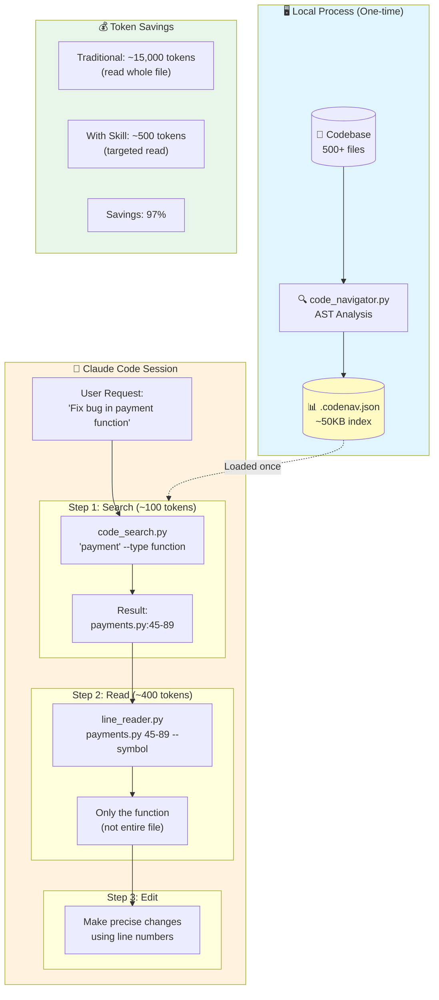

# Code Map Navigator - Architecture

## Components

### 1. Code Mapper (`code_navigator.py`)
Runs locally, generates a JSON index of the entire codebase:
- Functions, classes, methods with exact line numbers
- Signatures and truncated docstrings
- Dependency graph (what calls what)
- File hashes for change detection

### 2. Code Search (`code_search.py`)
Queries the pre-built index:
- Symbol search by name (fuzzy matching)
- Filter by type (function, class, method)
- File structure visualization
- Dependency analysis

### 3. Line Reader (`line_reader.py`)
Surgical precision for reading code:
- Read specific line ranges
- Multiple ranges in one call
- Smart truncation for large symbols
- Pattern search within files

## Token Optimization Flow

```
┌─────────────────────────────────────────────────────────────┐
│                    WITHOUT THIS SKILL                        │
├─────────────────────────────────────────────────────────────┤
│  User: "Fix the payment bug"                                │
│                                                             │
│  Claude reads:                                              │
│  • payments.py      (500 lines)  → 7,500 tokens            │
│  • billing.py       (300 lines)  → 4,500 tokens            │
│  • models/order.py  (200 lines)  → 3,000 tokens            │
│  ─────────────────────────────────────────────             │
│  Total:                            15,000 tokens            │
└─────────────────────────────────────────────────────────────┘

┌─────────────────────────────────────────────────────────────┐
│                     WITH THIS SKILL                          │
├─────────────────────────────────────────────────────────────┤
│  User: "Fix the payment bug"                                │
│                                                             │
│  1. Search: "payment" → payments.py:45-89                   │
│     Cost: ~100 tokens                                       │
│                                                             │
│  2. Read: lines 45-89 only                                  │
│     Cost: ~400 tokens                                       │
│  ─────────────────────────────────────────────             │
│  Total:                               500 tokens            │
│                                                             │
│  SAVINGS: 97% fewer tokens!                                 │
└─────────────────────────────────────────────────────────────┘
```

## Installation

1. Extract `codenav.skill` to your Claude Code skills directory
2. Run initial mapping: `python code_navigator.py /your/project`
3. Use search and read commands during sessions

## Supported Languages

| Language   | Analysis Type | Quality |
|------------|---------------|---------|
| Python     | Full AST      | ⭐⭐⭐⭐⭐ |
| JavaScript | Regex-based   | ⭐⭐⭐⭐   |
| TypeScript | Regex-based   | ⭐⭐⭐⭐   |
| Java       | Regex-based   | ⭐⭐⭐    |
| Go         | Regex-based   | ⭐⭐⭐    |
| Rust       | Regex-based   | ⭐⭐⭐    |
| C/C++      | Regex-based   | ⭐⭐⭐    |
